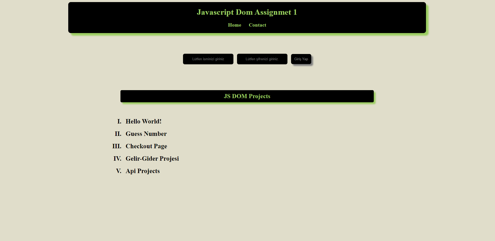

<h1>JS DOM PROJECT</h1>



[👉click here to login Js Dom Project](https://ilkerkr.github.io/JS-DOM-Project/)

<h2> Description</h2>

<p>
My aim in this project is to modify the given html structure using JS DOM.
</P>

<h2>Project Skeleton</h2>

```
JS DOM PROJECT (folder)
|
|----readme.md                  
|----index.html            
|----js.js 
|----image.png 
```